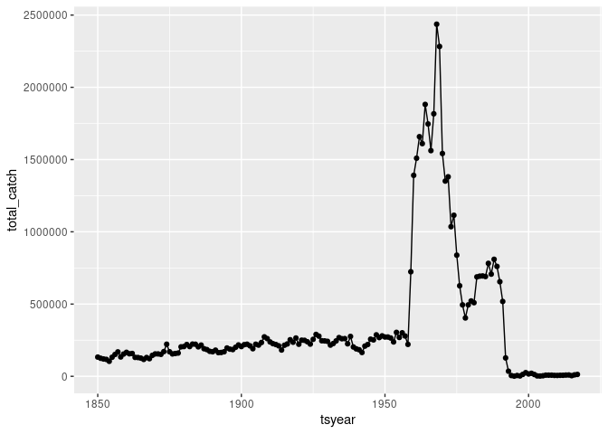
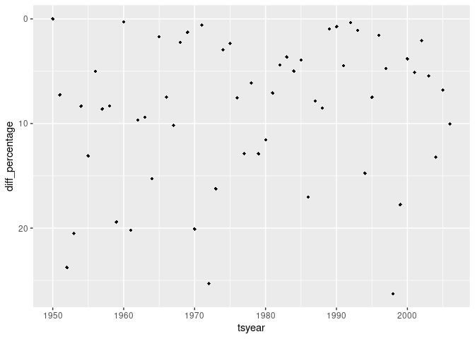
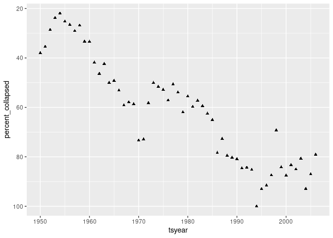
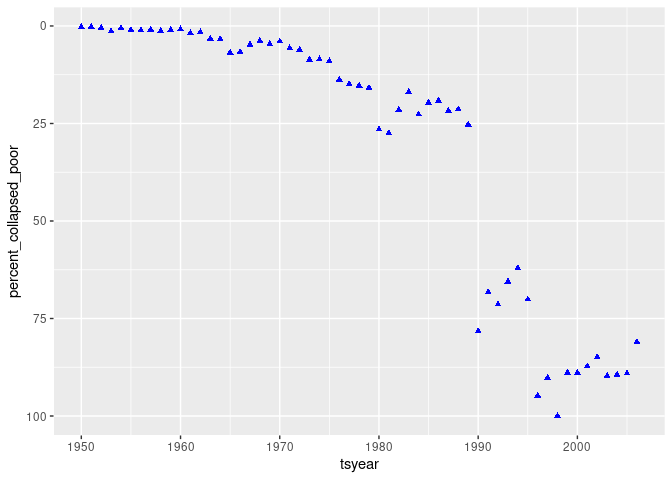
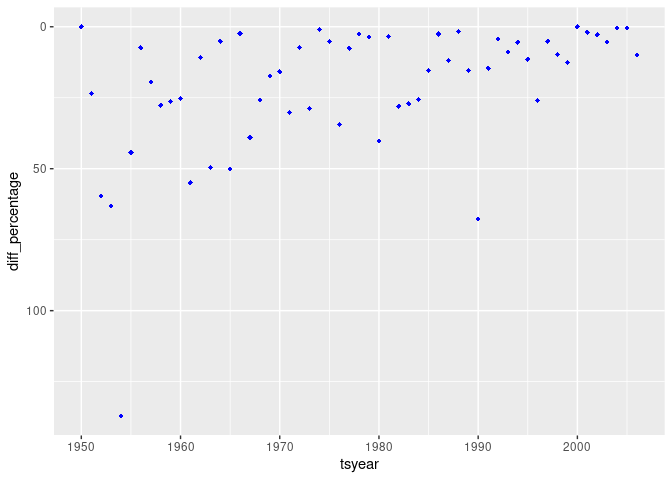
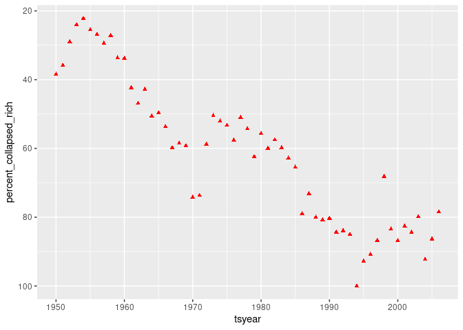
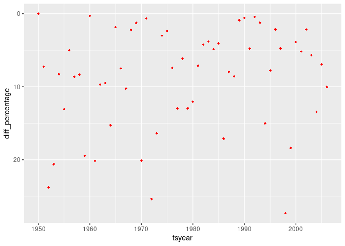
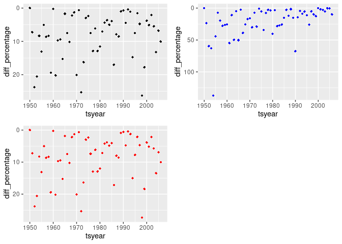

``` r
library(tidyverse)
library(contentid)
library(dplyr)
library(ggplot2)
library(ggpubr)
```

# Unit 2: Fisheries Collapse Module

This module will focus on understanding and replicating fisheries stock
assessment data and fisheries collapse.

Instead of working with independent data.frames, we will be working with
a large relational database which contains many different tables of
different sizes and shapes, but that all all related to each other
through a series of different ids.

## The Database

We will use data from the [RAM Legacy Stock Assessment
Database](https://www.ramlegacy.org/database/)

# Exercise 1: Investigating the North-Atlantic Cod

Now we are ready to dive into our data. First, We seek to replicate the
following figure from the Millennium Ecosystem Assessment Project using
the RAM data.


``` r
zip <- resolve("hash://md5/688d450bfd59849e0522c3c5e18d1b66", store=TRUE)

dest <- tempfile()
unzip(zip, exdir = dest)
load(fs::dir_ls(file.path(dest, "R Data"), glob="*.RData"))
```

``` r
ts <- timeseries %>% as_tibble()

fish <- ts %>%
  left_join(stock, bu = 'stockid') %>%
  left_join(area, by = 'areaid') %>%
  left_join(tsmetrics, by = c('tsid' = 'tsunique'))
```

    ## Joining, by = c("stockid", "stocklong")

``` r
## left_join is saying you are joining to the table being piped
```

``` r
cod <- fish %>% 
    select(stockid, areaid, tsyear, tsvalue, tsid, commonname, scientificname, country, areaname) %>%
  filter(commonname == 'Atlantic cod', tsid == 'TCbest-MT') %>%
  distinct()

cod %>% count(areaname)
```

    ## # A tibble: 28 × 2
    ##    areaname                  n
    ##    <chr>                 <int>
    ##  1 Celtic Sea              103
    ##  2 Eastern Baltic          187
    ##  3 Eastern Scotian Shelf    45
    ##  4 Faroe Bank               88
    ##  5 Faroe Plateau           142
    ##  6 Flemish Cap              53
    ##  7 Georges Bank             46
    ##  8 Gulf of Maine            73
    ##  9 Iceland Grounds         146
    ## 10 ICES 3a(west)-4-7d      379
    ## # … with 18 more rows

``` r
cod_totals <- cod %>%
  filter(areaname == 'Southern Labrador-Eastern Newfoundland') %>%
  group_by(tsyear) %>% summarize(total_catch = sum(tsvalue, na.rm = TRUE))
```

## placeholder

``` r
cod_totals %>% ggplot(aes(tsyear, total_catch)) + geom_point() + geom_line()
```

<!-- -->

-----

# Exercise 2: Group Assignment

## Stock Collapses

We seek to replicate the temporal trend in stock declines shown in [Worm
et al 2006](http://doi.org/10.1126/science.1132294):


``` r
cod_totals %>% mutate(collapsed = (total_catch < .10 * cummax(total_catch)) )
```

    ## # A tibble: 168 × 3
    ##    tsyear total_catch collapsed
    ##     <dbl>       <dbl> <lgl>    
    ##  1   1850      133000 FALSE    
    ##  2   1851      125000 FALSE    
    ##  3   1852      120000 FALSE    
    ##  4   1853      117000 FALSE    
    ##  5   1854      104000 FALSE    
    ##  6   1855      132000 FALSE    
    ##  7   1856      151000 FALSE    
    ##  8   1857      169000 FALSE    
    ##  9   1858      134000 FALSE    
    ## 10   1859      154000 FALSE    
    ## # … with 158 more rows

``` r
fish_tc <- fish %>% 
  select(stockid, areaid, tsyear, tsvalue, tsid, commonname, scientificname, country, areaname) %>%
  filter(tsid == 'TCbest-MT') %>%
  distinct()

fish_collapse <- fish_tc %>% 
  filter(tsyear >= 1950 & tsyear <= 2006) %>%
  group_by(tsyear) %>%
  summarize(total_catch = sum(tsvalue, na.rm = TRUE), .groups = 'drop') %>%
  mutate(collapsed = (total_catch < .10 * cummax(total_catch)), cummax = 0.1 * cummax(total_catch)) %>% 
  mutate(percent_collapsed = total_catch/max(total_catch) * 100) %>%
  mutate(diff = total_catch - lag(total_catch, default = first(total_catch))) %>%
  mutate(diff_percentage = abs(diff)/total_catch * 100) 

black_diamonds_yearly <- fish_collapse %>% ggplot(aes(tsyear, diff_percentage)) + geom_point(shape=18) + scale_y_reverse()
black_diamonds_yearly
```

<!-- -->

``` r
black_triangles <- fish_collapse %>% ggplot(aes(tsyear, percent_collapsed)) + geom_point(shape=17) + scale_y_reverse()
black_triangles
```

<!-- -->

``` r
fish_count <- 
  fish %>% count(commonname)

species_poor <- fish_count %>%
  filter(n <= 500)

species_poor_count <- left_join(species_poor, fish_tc, by = "commonname") %>%
  filter(tsyear >= 1950 & tsyear <= 2006) %>%
  group_by(tsyear) %>%
  summarize(total_catch = sum(tsvalue, na.rm = TRUE), .groups = 'drop') %>%
  mutate(collapsed = (total_catch < .10 * cummax(total_catch)), cummax = 0.1 * cummax(total_catch)) %>% 
  mutate(percent_collapsed_poor = total_catch/(max(total_catch)) * 100) %>%
  mutate(diff = total_catch - lag(total_catch, default = first(total_catch))) %>%
  mutate(diff_percentage = abs(diff)/total_catch * 100) 

species_poor_cum_collapse <- ggplot(species_poor_count, aes(x = tsyear)) + 
  geom_point(aes(y = percent_collapsed_poor), color = "blue", shape=17) +
  scale_y_reverse()
species_poor_cum_collapse
```

<!-- -->

``` r
species_poor_yr_collapse <- ggplot(species_poor_count, aes(x = tsyear)) + 
  geom_point(aes(y = diff_percentage), color = "blue", shape=18) +
  scale_y_reverse()
species_poor_yr_collapse
```

<!-- -->

``` r
species_rich <- fish_count %>%
  filter(n > 500)

species_rich_count <- left_join(species_rich, fish_tc, by = "commonname") %>%
  filter(tsyear >= 1950 & tsyear <= 2006) %>%
  group_by(tsyear) %>%
  summarize(total_catch = sum(tsvalue, na.rm = TRUE), .groups = 'drop') %>%
  mutate(collapsed = (total_catch < .10 * cummax(total_catch)), cummax = 0.1 * cummax(total_catch)) %>% 
  mutate(percent_collapsed_rich = total_catch/(max(total_catch)) * 100) %>%
  mutate(diff = total_catch - lag(total_catch, default = first(total_catch))) %>%
  mutate(diff_percentage = abs(diff)/total_catch * 100) 

species_rich_cum_collapse <- ggplot(species_rich_count, aes(x = tsyear)) + 
  geom_point(aes(y = percent_collapsed_rich), color = "red", shape=17) +
  scale_y_reverse()
species_rich_cum_collapse
```

<!-- -->

``` r
species_rich_yr_collapse <- ggplot(species_rich_count, aes(x = tsyear)) + 
  geom_point(aes(y = diff_percentage), color = "red", shape=18) +
  scale_y_reverse()
species_rich_yr_collapse
```

<!-- -->

``` r
diamonds <- ggarrange(black_diamonds_yearly, species_poor_yr_collapse, species_rich_yr_collapse)
diamonds
```

<!-- -->
